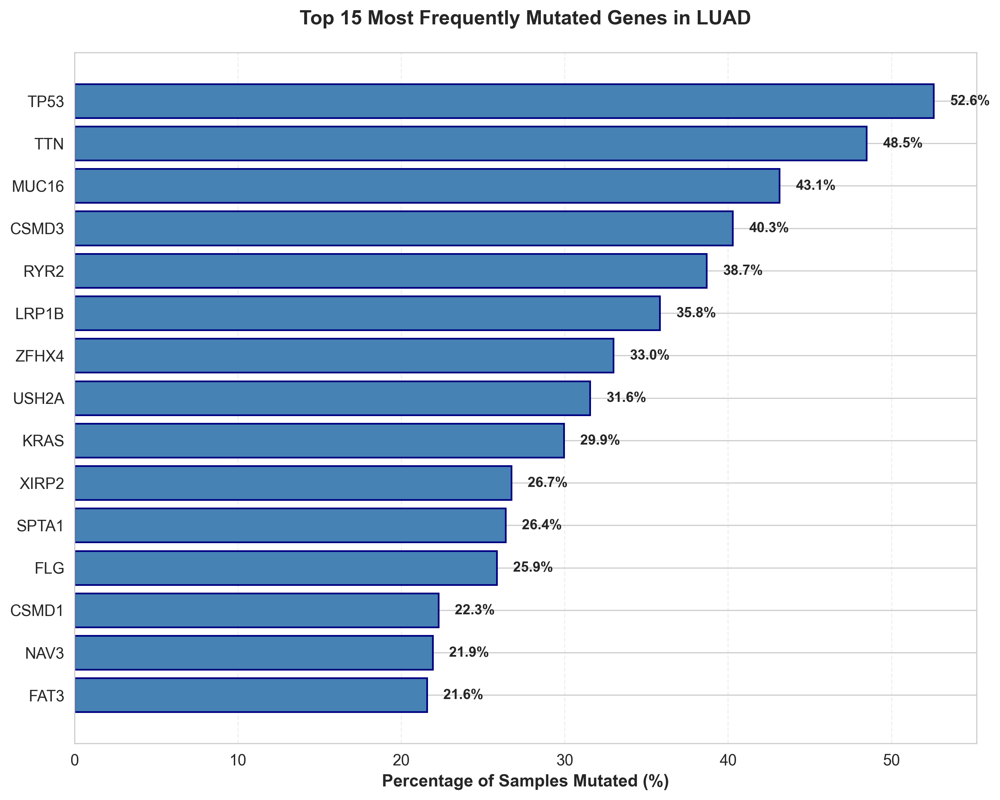

# Cancer Genomics Analysis Pipeline

A comprehensive bioinformatics pipeline for analyzing TCGA cancer mutation data, calculating tumor mutation burden (TMB), and generating publication-quality visualizations.

[](https://www.python.org/downloads/)
[](https://opensource.org/licenses/MIT)

---

## Table of Contents

- [Overview](#overview)
- [Features](#features)
- [Installation](#installation)
- [Quick Start](#quick-start)
- [Configuration](#configuration)
- [Pipeline Steps](#pipeline-steps)
- [Output](#output)
- [Analyzing Different Cancer Types](#analyzing-different-cancer-types)
- [Docker Usage](#docker-usage)
- [Project Structure](#project-structure)
- [Examples](#examples)
- [Citation](#citation)

---

## Overview

This pipeline downloads and analyzes cancer genomics data from [TCGA (The Cancer Genome Atlas)](https://www.cancer.gov/tcga) via [cBioPortal](https://www.cbioportal.org/). It performs comprehensive mutation analysis, calculates clinically-relevant biomarkers, and generates professional visualizations.

**Default Analysis:** Lung Adenocarcinoma (LUAD)  
**Easily Configurable:** Works with any TCGA cancer type (BRCA, COADREAD, GBM, etc.)

### Key Biological Insights
- Identifies driver genes (e.g., TP53, KRAS in LUAD)
- Calculates Tumor Mutation Burden (TMB) - FDA-approved biomarker
- Performs survival analysis (Kaplan-Meier curves)
- Visualizes mutation landscape (oncoplots)

---

## Features

### Data Processing
- Downloads mutation data from cBioPortal API
- Extracts clinical and survival information
- Calculates Tumor Mutation Burden (TMB)
- Identifies top mutated genes
- Creates binary mutation matrices
- Integrates multi-modal data

### Visualizations
1. **Gene Frequency Bar Chart** - Most commonly mutated genes
2. **TMB Distribution** - Histogram with clinical cutoffs
3. **Oncoplot** - Mutation landscape heatmap (signature cancer genomics viz)
4. **Kaplan-Meier Survival Curves** - TMB vs survival analysis
5. **Interactive Dashboard** - Plotly scatter plot (TMB vs survival)

### Technologies
- **Python 3.10+** with pandas, matplotlib, seaborn, plotly
- **Survival analysis** with lifelines
- **Statistical testing** (log-rank test)
- **Docker** support for reproducibility

---

## Installation

### Option 1: Local Installation (Conda - Recommended)
```bash
# Clone the repository
git clone https://github.com/YOUR_USERNAME/cancer-genomics-analysis.git
cd cancer-genomics-analysis

# Create conda environment
conda env create -f environment.yml
conda activate cancer-genomics

# Verify installation
python --version  # Should be 3.10+
```

### Option 2: Local Installation (pip + venv)
```bash
# Clone the repository
git clone https://github.com/YOUR_USERNAME/cancer-genomics-analysis.git
cd cancer-genomics-analysis

# Create virtual environment
python3 -m venv venv
source venv/bin/activate  # On Windows: venv\Scripts\activate

# Install dependencies
pip install -r requirements.txt
```

### Option 3: Docker (Most Reproducible)
```bash
# Clone the repository
git clone https://github.com/YOUR_USERNAME/cancer-genomics-analysis.git
cd cancer-genomics-analysis

# Build and run with Docker Compose
docker-compose up -d

# Enter the container
docker exec -it cancer-genomics-pipeline bash

# Now run scripts inside container
python scripts/01_download_data.py
```

---

## ⚡ Quick Start

### Run the Complete Pipeline
```bash
# 1. Download data (~2 minutes)
python scripts/01_download_data.py

# 2. Process data (~1 minute)
python scripts/02_process_data.py

# 3. Generate visualizations (~2 minutes)
python scripts/03_visualize.py
```

**Total runtime:** ~5 minutes for LUAD (566 samples)

### Output Location
All results saved to:
- `data/raw/` - Downloaded raw data
- `data/processed/` - Clean, analysis-ready data
- `outputs/figures/` - Publication-quality figures

---

## Configuration

Edit `config.yaml` to analyze different cancer types:
```yaml
study:
  study_id: "luad_tcga_pan_can_atlas_2018"  # Change this!
  cancer_name: "Lung Adenocarcinoma"
  cancer_abbreviation: "LUAD"

analysis:
  top_genes: 20
  tmb_cutoff: 10  # Clinical cutoff for immunotherapy
```

---

## Pipeline Steps

### Script 1: Data Download (`01_download_data.py`)
- Connects to cBioPortal API
- Downloads mutation data (MAF format)
- Retrieves clinical and survival data
- **Output:** 3 CSV files in `data/raw/`

### Script 2: Data Processing (`02_process_data.py`)
- Extracts gene symbols
- Calculates TMB (mutations per megabase)
- Identifies top mutated genes
- Creates mutation matrix (samples × genes)
- Prepares survival data
- Integrates all datasets
- **Output:** 5 CSV files in `data/processed/`

### Script 3: Visualization (`03_visualize.py`)
- Creates 5 publication-quality figures
- Includes statistical testing (log-rank test)
- Generates interactive HTML dashboard
- **Output:** 5 visualizations in `outputs/figures/`

---

## Output

### Generated Visualizations

#### 1. Gene Frequency Bar Chart

*Shows top 15 mutated genes and their frequencies*

#### 2. TMB Distribution

*Histogram with clinical cutoff at 10 mutations/Mb*

#### 3. Oncoplot (Mutation Landscape)

*Heatmap showing which genes are mutated in which samples*

#### 4. Kaplan-Meier Survival Curves

*Compares survival between high and low TMB groups*

#### 5. Interactive Dashboard

*Plotly scatter plot - open the .html file to interact!*

### Processed Data Files
- `tmb_data.csv` - TMB scores for each sample
- `mutation_matrix.csv` - Binary mutation matrix
- `survival_data.csv` - Time-to-event data
- `integrated_data.csv` - All data merged
- `top_mutated_genes.csv` - Gene frequencies

---

## Analyzing Different Cancer Types

This pipeline works with **any TCGA PanCancer Atlas study**!

### Examples:

#### Breast Cancer (BRCA)
```yaml
# config.yaml
study:
  study_id: "brca_tcga_pan_can_atlas_2018"
  cancer_name: "Breast Invasive Carcinoma"
  cancer_abbreviation: "BRCA"
```

#### Colorectal Cancer (COADREAD)
```yaml
study:
  study_id: "coadread_tcga_pan_can_atlas_2018"
  cancer_name: "Colorectal Adenocarcinoma"
  cancer_abbreviation: "COADREAD"
```

#### Glioblastoma (GBM)
```yaml
study:
  study_id: "gbm_tcga_pan_can_atlas_2018"
  cancer_name: "Glioblastoma Multiforme"
  cancer_abbreviation: "GBM"
```

### Find More Study IDs
Visit [cBioPortal Datasets](https://www.cbioportal.org/datasets) and look for studies ending in `_tcga_pan_can_atlas_2018`

### Run Analysis
```bash
# 1. Edit config.yaml with new study_id
# 2. Clear previous data (optional)
rm -rf data/* outputs/*

# 3. Run pipeline
python scripts/01_download_data.py
python scripts/02_process_data.py
python scripts/03_visualize.py
```

---

## 🐳 Docker Usage

### Build and Run
```bash
# Build image
docker-compose build

# Start container
docker-compose up -d

# Enter container
docker exec -it cancer-genomics-pipeline bash

# Run pipeline inside container
python scripts/01_download_data.py
python scripts/02_process_data.py
python scripts/03_visualize.py

# Exit container
exit

# Results are saved to your local machine via volume mounts!
```

### Stop Container
```bash
docker-compose down
```

---

## 📁 Project Structure
```
cancer-genomics-analysis/
├── config.yaml                 # Configuration file
├── environment.yml             # Conda environment
├── requirements.txt            # Python dependencies
├── Dockerfile                  # Docker image definition
├── docker-compose.yml          # Docker orchestration
├── README.md                   # This file
├── .gitignore                  # Git ignore rules
│
├── utils/                      # Utility functions
│   ├── __init__.py
│   └── display.py              # Print formatting utilities
│
├── scripts/                    # Analysis pipeline
│   ├── 01_download_data.py     # Download from cBioPortal
│   ├── 02_process_data.py      # Process and clean data
│   └── 03_visualize.py         # Generate visualizations
│
├── data/                       # Data directory (gitignored)
│   ├── raw/                    # Downloaded data
│   └── processed/              # Clean data
│
├── outputs/                    # Results (gitignored except examples)
│   └── figures/                # Visualizations
│
└── notebooks/                  # Jupyter notebooks (optional)
    └── exploratory_analysis.ipynb
```

---

## Examples

### Expected Results (LUAD)
```
Mutations: 157,145 variants
Samples: 566 samples
Patients: 566 patients

Top Mutated Genes:
  TP53: 295 samples (52.58%)
  KRAS: 168 samples (29.95%)
  STK11: 98 samples (17.47%)

TMB Statistics:
  Mean: 7.37 mutations/Mb
  Median: 5.05 mutations/Mb
  High TMB (≥10): 138 samples (24.6%)

Survival Analysis:
  Median survival (High TMB): 47.8 months
  Median survival (Low TMB): 49.3 months
  Log-rank p-value: 0.2598 (not significant)
```

---

## 🧬 Biological Interpretation

### What This Pipeline Reveals

1. **Driver Genes:** TP53 and KRAS mutations are common in LUAD
2. **TMB Distribution:** Most tumors have modest mutation burden
3. **Mutation Patterns:** Oncoplot shows tumor heterogeneity
4. **Clinical Relevance:** ~25% of patients have high TMB (may benefit from immunotherapy)
5. **Survival:** In this cohort, TMB doesn't predict survival (p=0.26)

### Clinical Significance
- **TMB ≥ 10 mut/Mb** is FDA-approved biomarker for pembrolizumab (Keytruda)
- High TMB tumors often respond better to immune checkpoint inhibitors
- This analysis helps identify which patients might benefit

---

## Contributing

Contributions welcome! Please:
1. Fork the repository
2. Create a feature branch (`git checkout -b feature/amazing-feature`)
3. Commit changes (`git commit -m 'Add amazing feature'`)
4. Push to branch (`git push origin feature/amazing-feature`)
5. Open a Pull Request

---

## License

This project is licensed under the MIT License - see [LICENSE](LICENSE) file for details.

---

## Citation

If you use this pipeline in your research, please cite:
```bibtex
@software{cancer_genomics_pipeline,
  author = {Daniel Lee},
  title = {Cancer Genomics Analysis Pipeline},
  year = {2026},
  url = {https://github.com/dlee922/cancer-genomics-analysis}
}
```

### Data Citation
Data from: The Cancer Genome Atlas (TCGA) via cBioPortal
- Cerami et al. (2012) CBio Cancer Genomics Portal
- Gao et al. (2013) Integrative analysis of complex cancer genomics

---

## Acknowledgments

- **TCGA** for providing open-access cancer genomics data
- **cBioPortal** for excellent API and data hosting
- **Northeastern University** Bioinformatics Program

---

## Contact

**Daniel Lee**  
MS Bioinformatics Student, Northeastern University  
Email: lee.daniel1@northeastern.edu  
Connect with me: [LinkedIn](https://www.linkedin.com/in/daniellee922)